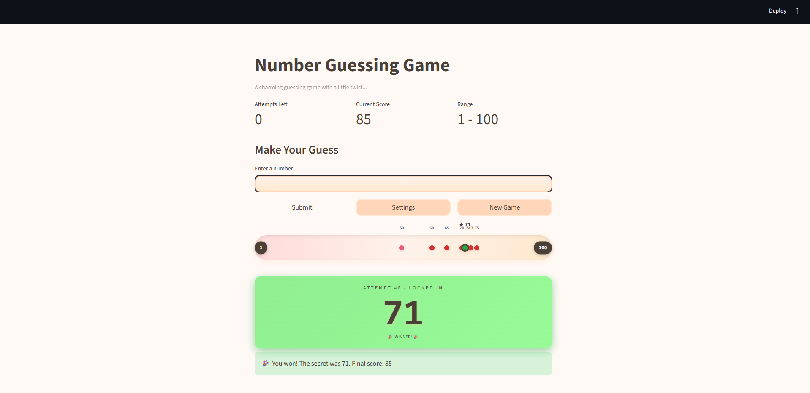
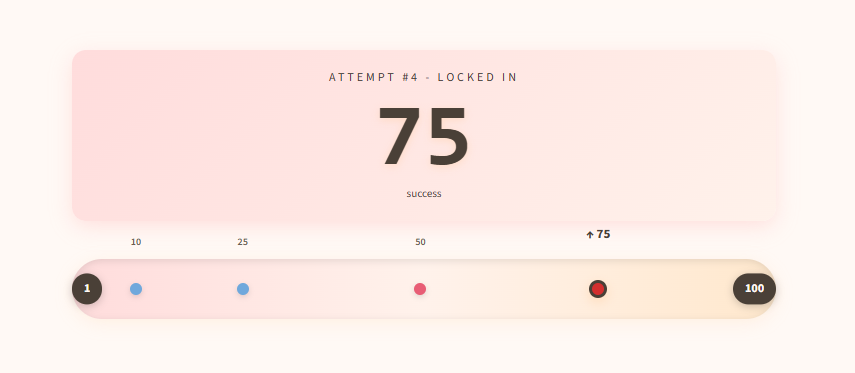

# 🎮 Game Glitch Investigator: The Impossible Guesser

## 🚨 The Situation

You asked an AI to build a simple "Number Guessing Game" using Streamlit.
It wrote the code, ran away, and now the game is unplayable.

- You can't win.
- The hints lie to you.
- The secret number seems to have commitment issues.

## 🛠️ Setup

1. Install dependencies: `pip install -r requirements.txt`
2. Run the broken app: `python -m streamlit run app.py`

## 🕵️‍♂️ Your Mission

1. **Play the game.** Open the "Developer Debug Info" tab in the app to see the secret number. Try to win.
2. **Find the State Bug.** Why does the secret number change every time you click "Submit"? Ask ChatGPT: _"How do I keep a variable from resetting in Streamlit when I click a button?"_
3. **Fix the Logic.** The hints ("Higher/Lower") are wrong. Fix them.
4. **Refactor & Test.** - Move the logic into `logic_utils.py`.
   - Run `pytest` in your terminal.
   - Keep fixing until all tests pass!

## 🎯 Features

### Game Mechanics

- **Three Difficulty Levels**: Easy (1–20), Normal (1–100), Hard (1–1000) with varying attempt limits
- **Scoring System**: Earn points based on the number of attempts needed to win (100 - 10 × attempts)
- **Guess Validation**: Prevents invalid inputs (empty, non-numeric) from consuming attempts
- **Attempt Tracking**: Real-time display of remaining attempts in the sidebar

### Visual Enhancements

- **Cozy Theme**: Warm color palette (peach, pink, cream, tan) with custom styling throughout the UI
- **Rolling Animation**: Smooth animated counter that transitions from previous guess to current guess
- **Number Range Tracker**: Interactive visualization showing:
  - Your guess history as color-coded markers
  - Current guess with distinct styling
  - Secret number location (in debug mode)
  - Distance-based coloring: Red (close) → Blue (far)
- **Responsive Design**: Mobile-friendly interface that adapts to different screen sizes

### Developer Features

- **Debug Info Panel**: Toggle to reveal secret number, game state, and guess history
- **Session State Management**: Robust game state persistence across Streamlit reruns
- **Input Error Handling**: Clear error messages for invalid guesses

## 📝 Document Your Experience

### Game Purpose

Game Glitch Investigator is a number guessing game built with Streamlit. The player selects a difficulty level (Easy: 1–20, Normal: 1–100, Hard: 1–50), then tries to guess a secret random number within the allowed attempts. After each guess, the game provides a "Go Higher" or "Go Lower" hint. The player wins by guessing correctly before running out of attempts, and earns points based on how few attempts they used.

### Bugs Found

| #   | Bug                                                                                                                                                     | Location                         |
| --- | ------------------------------------------------------------------------------------------------------------------------------------------------------- | -------------------------------- |
| 1   | **Backwards hints** — "Go Higher" and "Go Lower" were swapped, pointing the player in the wrong direction                                               | `logic_utils.py: check_guess()`  |
| 2   | **Secret number reset on every rerun** — the number was assigned at the top level of `app.py`, so Streamlit regenerated it on every button click        | `app.py`                         |
| 3   | **Attempts display off by one** — the "Attempts Left" counter showed `n+1` instead of the correct remaining count                                       | `app.py`                         |
| 4   | **New Game button broken** — clicking New Game did not properly reset game state                                                                        | `app.py`                         |
| 5   | **First guess not logged** — the initial guess wasn't recorded in the history until a second submit was made                                            | `app.py`                         |
| 6   | **Invalid inputs consumed attempts** — submitting empty or non-numeric input still decremented the attempt counter and was written to the guess history | `app.py`                         |
| 7   | **Scoring offset bug** — a `+1` offset in `update_score` caused a first-attempt win to score 80 instead of the intended 90                              | `logic_utils.py: update_score()` |
| 8   | **Even-attempt bonus** — wrong guesses on even attempts incorrectly added points instead of deducting them                                              | `logic_utils.py: update_score()` |

### Fixes Applied

1. **Backwards hints** — swapped the inequality signs in `check_guess()` so `guess > secret` returns `"Too High"` and `"Go LOWER!"`, and `guess < secret` returns `"Too Low"` and `"Go HIGHER!"`.

2. **Secret number reset** — wrapped the secret number assignment in a `st.session_state` check (`if "secret" not in st.session_state`) so it is only generated once per game session and survives Streamlit reruns.

3. **Attempts display** — corrected the counter expression so it accurately reflects remaining attempts without the off-by-one offset.

4. **New Game button** — updated the reset handler to clear all relevant session state keys (`secret`, `attempts`, `score`, `history`, `game_over`) and trigger a proper rerun.

5. **First guess logging** — moved history appending to execute immediately on the first valid submit, ensuring every guess is captured in order.

6. **Invalid inputs consuming attempts** — moved the attempt-decrement and history-append logic inside the valid-guess branch so non-numeric or empty inputs are rejected with an error message and do not cost an attempt.

7. **Scoring offset** — removed the `+1` offset from `update_score()` so the points formula is `100 - (10 * attempt_number)`, correctly awarding 90 points for a first-attempt win.

8. **Even-attempt bonus** — removed the conditional bonus that added points on even-numbered wrong guesses; all wrong guesses now consistently deduct 5 points.

## 📸 Demo

- 

## 🚀 Stretch Features

Added a number roller and a gradient number tracker for guesses.

- 
